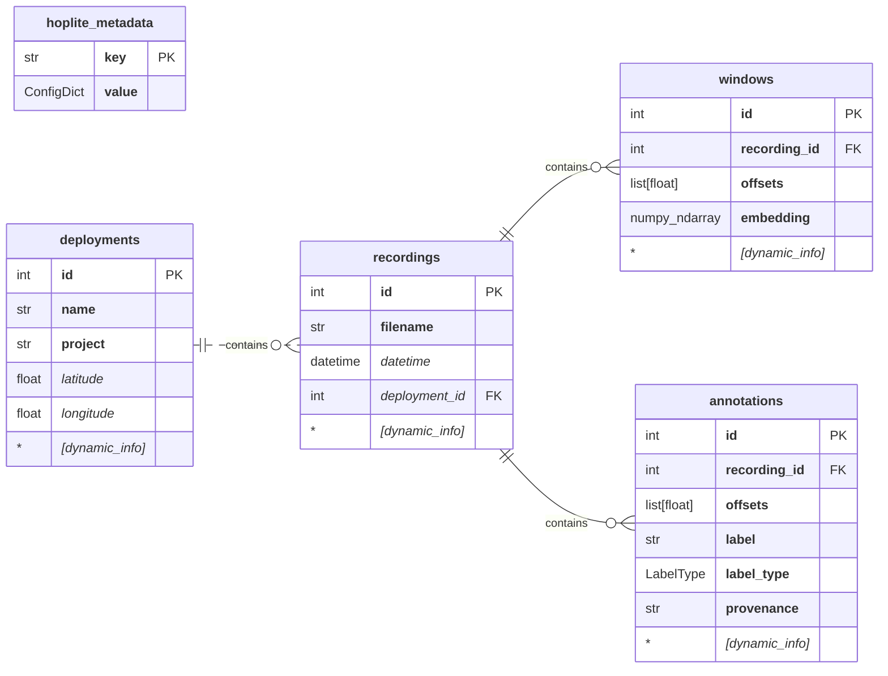

# Hoplite db

Hoplite is a database for working with large numbers of embeddings.

We develop it with bioacoustic audio applications in mind, where we have a large
number of audio files and (usually) a small number of human annotations on those
files. Each audio file is typically split up into (possibly overlapping) audio
windows, and we have an embedding for each audio window.

Structurally, however, the database is not limited to audio, and may be useful
for other domains as well (image embeddings, satellite image embeddings, etc).

The database handles the embeddings, source metadata for each embedding
(recordings and deployments), annotations (labels) for individual embeddings,
and a graph structure (edges) on the embeddings (used for fast approximate
nearest neighbor search).

## Backends

The Hoplite database is accessed via the API in `interface.py`. It is possible
to reimplement the API on different backends. As of this writing, two backends
are implemented: a SQLite+USearch database, and an in-memory database
implemented through a collection of dicts and NumPy arrays.

The `db_loader.py` file contains some tooling for copying a Hoplite databases,
including into a new backend (e.g. for persisting an in-memory database to
SQLite+USearch.)

## Database structure

Conceptually, the database is organized under the following structure. Each
implementation, however, may make slight adjustments to it for performance
reasons (e.g. the SQLite+USearch database stores embedding vectors into USearch,
basically splitting the `windows` table below into 2 different data structures).
For simplicity, though, you should think of your embeddings and associated
metadata in terms of these 4 different concepts: __deployments__, __recordings__,
__windows__ and __annotations__. Also, hoplite-specific metadata is stored in a
separate table called __hoplite_metadata__.



In the diagram above, __bold attributes__ are required and _italic attributes_
are optional. `PK` (primary key) attributes are used to uniquely identify
individual items, while `FK` (foreign key) attributes are used to reference
primary keys from different tables.

Each table (apart from `hoplite_metadata`) can be extended with an arbitrary
number of extra columns (what's referred to as `[dynamic_info]` in the diagram)
via additional calls like these:

```python
# Add an `int` column to the `deployments` table.
db.add_extra_table_column("deployments", "extra_column", int)

# Add a `float` column to the `recordings` table.
db.add_extra_table_column("recordings", "extra_column", float)

# Add a `str` column to the `windows` table.
db.add_extra_table_column("windows", "extra_column", str)

# Add a `bytes` column to the `annotations` table.
db.add_extra_table_column("annotations", "extra_column", bytes)
```

The tables within the database are used as follows:

- __deployments__: Stores metadata associated with sites and projects. Sometimes
  we may need to work with datasets that provide limited location information
  (or none at all), in which case we can either treat the entire dataset as a
  single project, or we can split it into several fake projects based on other
  characteristics.
- __recordings__: Stores metadata associated with individual audio recordings.
  It keeps track of filenames relative to a base directory, so that in case the
  recordings are moved, the database remains valid and only needs to be pointed
  to the new base directory. Recordings may or may not be associated with a
  deployment via the optional `deployment_id`, so that the user can choose if
  handling deployments metadata is relevant in their case.
- __windows__: Stores embedding vectors produced by some pretrained model (or in
  the case of SQLite+USearch, only gives them a unique id as they are stored
  separately in USearch), and also stores associated metadata. A window uniquely
  identifies the segment of a recording from which the embedding vector was
  computed, e.g. the start and the end offsets (in seconds) of the audio
  segment. For image applications, the same `offsets` column could be used to
  store bounding box information (e.g. all 4 corners).
- __annotations__: Stores annotations associated with recording segments: a
  string label, a label type (e.g. `POSITIVE` or `NEGATIVE`), its provenance
  (e.g. the annotator's name or an id of the model which produced a
  pseudo-label). You can have many annotations per embedding window, for example
  indicating different entities represented in the audio, or different annotator
  decisions for the same label+embedding pair.
- __hoplite_metadata__: Stores key-value pairs for arbitrary metadata associated
  with a Hoplite database. These are used, for example, to indicate which
  embedding model was used to produce the embeddings in the database.

## Usage

### Creating a Database

The in-memory database uses fixed-size NumPy arrays for storing embeddings and
requires a value for the embedding dimension at instantiation time, which should
be known from the embedding model. Optionally, an embedding dtype can also be
provided.

```python
import numpy as np
from perch_hoplite.db import in_mem_impl

db = in_mem_impl.InMemoryGraphSearchDB.create(
  embedding_dim=1280,
  embedding_dtype=np.float16,
)
```

The SQLite+USearch backend needs a local directory to create or load a database
from, and optionally a `usearch_cfg` ConfigDict.

```python
from perch_hoplite.db import sqlite_usearch_impl

db = sqlite_usearch_impl.SQLiteUSearchDB.create(
  db_path=YOUR_DB_PATH,
  usearch_cfg=sqlite_usearch_impl.get_default_usearch_config(
    embedding_dim=1280),
)
```

Once created, the database contains all the metadata described in the diagram
above. If more metadata columns are needed for any of the internal tables, they
can be created via `db.add_extra_table_column()` calls as previously explained.
For the following examples, let's now assume these extra columns were created:

```python
db.add_extra_table_column("deployments", "extra", int)
db.add_extra_table_column("recordings", "extra", int)
db.add_extra_table_column("windows", "extra", int)
db.add_extra_table_column("annotations", "extra", int)
```

### Working with Individual Deployments

Every new deployment requires at least a `name` and a `project`. Inserting a new
deployment can be done like this:

```python
deployment_id = db.insert_deployment(
  name="deployment1",
  project="project",
  latitude=3.0,
  longitude=5.0,
)
deployment_id = db.insert_deployment(
  name="deployment2",
  project="project",
  latitude=33.0,
  extra=100,
)
deployment_id = db.insert_deployment(
  name="deployment3",
  project="project",
  extra=1000,
)
deployment_id = db.insert_deployment(
  name="deployment4",
  project="project",
  longitude=-1.0,
)
deployment_id = db.insert_deployment(
  name="deployment5",
  project="project",
  extra=1000,
)
```

Retrieving an existing deployment can be done like this:

```python
deployment = db.get_deployment(deployment_id=1)
```

Removing an existing deployment can be done like this:

```python
db.remove_deployment(deployment_id=2)
```

**Warning!** Be careful that removing a deployment triggers the removal of
associated recordings, windows and annotations.

### Working with Individual Recordings

Every new recording requires at least a `filename`. Recordings don't necessarily
need to belong to a deployment (that's why `deployment_id` is optional), to make
things simpler for users with one single deployment and for users not interested
in working with deployment-level metadata. Inserting a new recording can be done
like this:

```python
import datetime as dt

recording_id = db.insert_recording(
  filename="f1",
)
recording_id = db.insert_recording(
  filename="f2",
  deployment_id=1,
)
recording_id = db.insert_recording(
  filename="f3",
  datetime=dt.datetime(2000, 1, 1),
  deployment_id=1,
)
recording_id = db.insert_recording(
  filename="f4",
  datetime=dt.datetime(2000, 1, 1),
  extra=5,
)
```

Retrieving an existing recording can be done like this:

```python
recording = db.get_recording(recording_id=1)
```

Removing an existing recording can be done like this:

```python
db.remove_recording(recording_id=2)
```

**Warning!** Be careful that removing a recording triggers the removal of
associated windows and annotations.

### Working with Individual Windows and Embeddings

Every new window requires at least a `recording_id`, some `offsets` and an
`embedding`. Inserting a new window can be done like this:

```python
import numpy as np

window_id = db.insert_window(
  recording_id=1,
  offsets=[0, 1],
  embedding=np.random.normal(size=1280),
)
window_id = db.insert_window(
  recording_id=1,
  offsets=[1, 2],
  embedding=np.random.normal(size=1280),
  extra=777,
)
window_id = db.insert_window(
  recording_id=1,
  offsets=[2, 3],
  embedding=np.random.normal(size=1280),
  extra=999,
)
```

Retrieving an existing window can be done like this:

```python
window = db.get_window(window_id=1)
```

By default this doesn't include the embedding vector (for efficiency purposes).
If that's needed, change the above call to:

```python
window = db.get_window(window_id=1, include_embedding=True)
```

Alternatively, if only the embedding vector is needed, use this instead:

```python
embedding = db.get_embedding(window_id=1)
```

And if you need more than one embedding at a time (i.e. a batch), use:

```python
embeddings = db.get_embeddings_batch(window_ids=[1, 2])
```

Finally, removing an existing window can be done like this:

```python
db.remove_window(window_id=3)
```

### Working with Individual Annotations

Every new annotation requires at least a `recording_id`, some `offsets`, a
`label`, a `label_type` and a `provenance`. Inserting a new annotation can be
done like this:

```python
from perch_hoplite.db.interface import LabelType

annotation_id = db.insert_annotation(
  recording_id=1,
  offsets=[0, 1],
  label="bird",
  label_type=LabelType.POSITIVE,
  provenance="me",
)
annotation_id = db.insert_annotation(
  recording_id=1,
  offsets=[1, 2],
  label="bat",
  label_type=LabelType.POSITIVE,
  provenance="me",
  extra=11,
)
annotation_id = db.insert_annotation(
  recording_id=1,
  offsets=[2, 3],
  label="wolf",
  label_type=LabelType.NEGATIVE,
  provenance="me",
)
annotation_id = db.insert_annotation(
  recording_id=1,
  offsets=[3, 4],
  label="wolf",
  label_type=LabelType.POSITIVE,
  provenance="me",
  skip_duplicates=True,
)
```

Retrieving an existing annotation can be done like this:

```python
annotation = db.get_annotation(annotation_id=1)
```

Removing an existing recording can be done like this:

```python
db.remove_annotation(annotation_id=2)
```

### Working with Filters

While working with complex metadata in Hoplite, a lot of scenarios may involve
some sort of efficient filtering. Let's first introduce the filter dict, then
the next section will show you how to use it with the Hoplite database.

A filter dict is just an `ml_collections.config_dict.ConfigDict` object with the
following structure:

```txt
{
  rule_type1: {
    column1: value1,
    column2: value2,
    ...
  },
  rule_type2: {
    column1: value1,
    column2: value2,
    ...
  },
  ...
}
```

Filter dicts can be used to retrieve items from the various database tables
(`deployments`, `recordings`, `windows` or `annotations`). Their values must
match _all_ the given rules and in practice a filter dict may look as complex
as:

```python
from ml_collections import config_dict

filter_dict = config_dict.create(
    eq=dict(column1=value1, column2=None),
    neq=dict(column1=value1, column2=None),
    lt=dict(column=value),
    lte=dict(column=value),
    gt=dict(column=value),
    gte=dict(column=value),
    isin=dict(column=[value1, value2, value3]),
    notin=dict(column=[value1, value2, value3]),
    range=dict(column=[value1, value2]),
    approx=dict(column=value),
)
```

Here's the significance of all the supported rules at the moment:

- __eq__: to test if given column is equal to given value
- __neq__: to test if given column is not equal to given value
- __lt__: to test if given column is less than given value
- __lte__: to test if given column is less than or equal to given value
- __gt__: to test if given column is greater than given value
- __gte__: to test if given column is greater than or equal to given value
- __isin__: to test if given column is in given list of values
- __notin__: to test if given column is not in given list of values
- __range__: to test if given column is between two values
- __approx__: to test if given column is approximately equal to given value
  (within 1e-6 difference); useful for floating point comparisons

### Working Efficiently

There are 3 general recommendations we can make to speed up your Hoplite
experience:

1. Insert embeddings in batches to speed up the updates in the vector database.
2. Retrieve embeddings in batches whenever you need more than one embedding.
3. Work with filters as much as you can to reduce the amount of (meta)data you
   need to process.

For a typical workflow in which you need to get the embeddings for a set of
window ids matching some metadata constraints, you can first apply filters on
the deployments, recordings, windows and/or annotations via
`db.match_window_ids()`, e.g.

```python
import datetime as dt

window_ids = db.match_window_ids(
  deployments_filter=config_dict.create(
    eq=dict(project="project"),
  ),
  recordings_filter=config_dict.create(
    notin=dict(filename=["f4", "f5", "f6"]),
  ),
  windows_filter=config_dict.create(
    range=dict(extra=[800, 1000]),
  ),
  annotations_filter=config_dict.create(
  ),
)
```

Then, you can retrieve batches of embeddings with:

```python
embeddings = db.get_embeddings_batch(window_ids)
```

Other database methods that support filter dicts for efficient filtering:

- `db.get_all_deployments(filter=...)`
- `db.get_all_recordings(filter=...)`
- `db.get_all_windows(include_embedding=..., filter=...)`
- `db.get_all_annotations(filter=...)`

### Utility functions

Additionally, the database interface offers some utility functions for common
functionality:

- `db.count_embeddings()`: for getting the number of embeddings currently in the
  database.
- `db.get_all_projects()`: for getting all distinct projects in the database.
- `db.get_all_labels(label_type=...)`: for getting all distinct labels from the
  database; can be used to filter by `POSITIVE` or `NEGATIVE` labels only.
- `db.count_each_label()`: for counting each label in the database, ignoring its
  provenance; can be used to filter by `POSITIVE` or `NEGATIVE` labels only.

## Vector Similarity Search

We provide utilities for both brute force and indexed vector search.

Vector search requires a "scoring function". In this library, higher scores must
indicate greater similarity, so good scoring functions include cosine
similarity, inner product or _negative_* Euclidean distance (nearest neighbor).

For bioacoustic embeddings we recommend *inner product*, as it handles mixture
embeddings for overlapping calls more gracefully than Euclidean distance or
cosine similarity. However, the user is invited to experiment!

### Brute-force Search

Brute force search capabilities are handled by `brutalism.py`. Here's some
example usage:

```python
from perch_hoplite.db import brutalism

query_embedding = np.random.normal(size=1280)
num_results = 5
score_fn = np.dot
results, all_scores = brutalism.threaded_brute_search(
  db,
  query_embedding,
  num_results,
  score_fn,
)

# The `results` are a `search_results.TopKSearchResults` object. This wraps a
# list of search results kept in heap order, but iterating over the
# `TopKSearchResults` object will yield results in descending order.
for r in results:
  print("window id:", r.window_id, "=>", "score:", r.sort_score)
```

Brute force search is appropriate in the following situations:

- Perfect recall is needed.
- The dataset contains less than about 1 million embeddings.
- A flexible scoring function is needed (e.g. for margin sampling).

We can also use sampled search to apply brute force search on a random subset of
data:

```python
# Find elements whose dot product with q is approximately 2.
weird_score_fn = lambda q, t: -np.abs(2.0 - np.dot(q, t))

results, all_scores = brutalism.threaded_brute_search(
  db,
  query_embedding,
  num_results,
  weird_score_fn,
  sample_size=0.1,  # Search a random 10% of the embeddings.
)

results, all_scores = brutalism.threaded_brute_search(
  db,
  query_embedding,
  num_results,
  weird_score_fn,
  sample_size=100_000,  # Search up to 100k randomly selected embeddings.
)
```

In short, you should only move to indexed search when you're really annoyed with
how slow brute force search is, don't mind missing some results, and have a
specific scoring function to work with.

### Indexed Vector Search

For very large datasets, approximate nearest neighbor search can greatly speed
up analysis. For this, we define a graph on the embeddings and explore using a
greedy nearest-neighbor search. The SQLite+USearch database stores all these
embeddings in a USearch vector database, which also provides all the approximate
nearest-neighbor search functionality. Here's an example how to use it:

```python
from perch_hoplite.db import search_results

query_embedding = np.random.normal(size=1280)
num_results = 5

matches = db.ui.search(query_embedding, count=num_results)
results = search_results.TopKSearchResults(top_k=num_results)
for k, d in zip(matches.keys, matches.distances):
  results.update(search_results.SearchResult(k, d))

# Iterating over the `TopKSearchResults` object will yield results in descending
# order.
for r in results:
  print("window id:", r.window_id, "=>", "score:", r.sort_score)
```